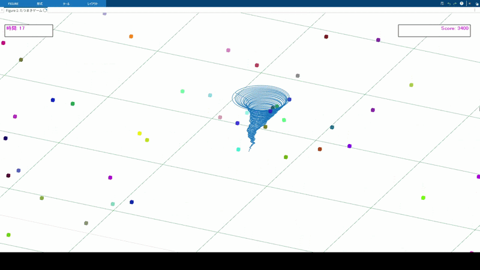

# matlab-tornado-game
まとらぼで作った竜巻のゲーム。
竜巻を操作し、フィールド上の塵やゴミを巻き上げて得点を競うミニゲームです。

---

## ルール

* 塵：100点
* ゴミ：1000点
* 制限時間：30

制限時間が経過する、またはEscキーを押すとゲームが終了し、最終得点が表示されます。

---

## 実行方法

1. tasumaki フォルダを右クリックし、「パスに追加」→「選択したフォルダーとサブフォルダー」を選択
2. tatsumaki フォルダを開き、main.m を実行

---

## 操作方法

* A キー：左旋回
* D キー：右旋回
* S キー：視点変更（押している間のみ有効）
* Esc キー：ゲーム終了

※ S キーはキーリリースが正しく検知されない場合があります。その際は再度押して解除してください。

---

## 注意事項

* 動作確認は MATLAB 2025b で行っています
* バージョン差異により動作が不安定になる可能性があります
* 動作が重い場合はmain.m` 内のkankaku 変数を大きくしてください（移動速度は低下します）
* Figure ウィンドウはドックから外してプレイすることを推奨します

---

## 用語

* 塵：小さくカラフルな立方体オブジェクト
* ゴミ：塵より大きいオブジェクト（球体、ヘリコプター、戦車、首領、寒天、毛男の6種類）

---

## 工夫した点

* 竜巻の形状変形や巻き上げ処理により、躍動感を持たせた
* 旋回時に速度が低下するペナルティを実装し、操作に戦略性を追加
* Blender で作成したSTL モデル（球体、首領、寒天、毛男）をMATLAB で読み込み・着色
* MATLAB の仕様を踏まえ、状態管理にhandle クラスを使用
* カメラ視点やオブジェクト座標を活用した処理設計

---

## ディレクトリ構成

* chiridata：塵オブジェクトの頂点・面データ
* kansu：関数およびハンドルクラス
* stl：ゴミオブジェクトのSTLファイル

---
